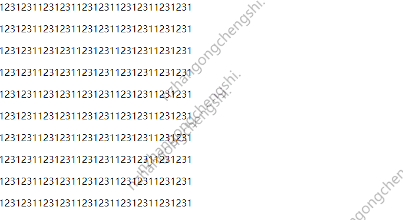

# 项目名称
- WebsiteRandomWatermark是一个功能强大的JavaScript框架，专门用于在网站上添加屏幕水印。它允许用户自定义水印的数量，随机设置水印的位置，以及为水印添加出场动画效果。此外，该框架还提供了防止用户复制网页内容的功能，以及在用户尝试复制内容时弹出提示窗口的选项。

## 简介
- WebsiteRandomWatermark是一个功能强大的JavaScript框架，专门用于在网站上添加屏幕水印。它允许用户自定义水印的数量，随机设置水印的位置，以及为水印添加出场动画效果。此外，该框架还提供了防止用户复制网页内容的功能，以及在用户尝试复制内容时弹出提示窗口的选项。


## 安装
- 请在你的网页head部分使用link标签引入文件WebsiteRandomWatermark.css，然后在网页的body后面使用script标签引入文件WebsiteRandomWatermark.js
- 
```
<!DOCTYPE html>
<html>
	<head>
		<meta charset="utf-8">
		<title></title>
		<link rel="stylesheet" href="./WebsiteRandomWatermark.css">
	</head>
	<body>
	</body>
		<script src="./WebsiteRandomWatermark.js"></script>
</html>
```

## 使用方法
- 如果需要修改水印参数，请前往文件WebsiteRandomWatermark.js的第132行，根据注释调整布尔值来决定是否启动功能。

## 许可证
- 本项目采用MIT LICENSE。
- MIT许可证的主要特点包括：
- 免费使用：用户可以自由地使用软件。
- 修改源代码：用户可以修改软件的源代码。
- 分发：用户可以分发软件的副本。
- 商业用途：用户可以将软件用于商业目的。
- 无担保：软件是“按原样”提供的，没有提供任何形式的担保。
- 免责声明：版权持有者不对使用软件可能引起的任何问题负责。

## 作者
- 沧桑

## 联系方式
- QQ:1316590732

## 发布时间
- 2024年8月19日00:09:18

## 演示

